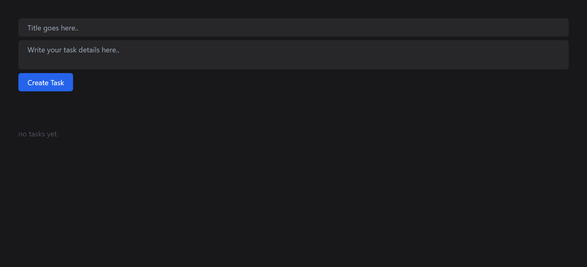
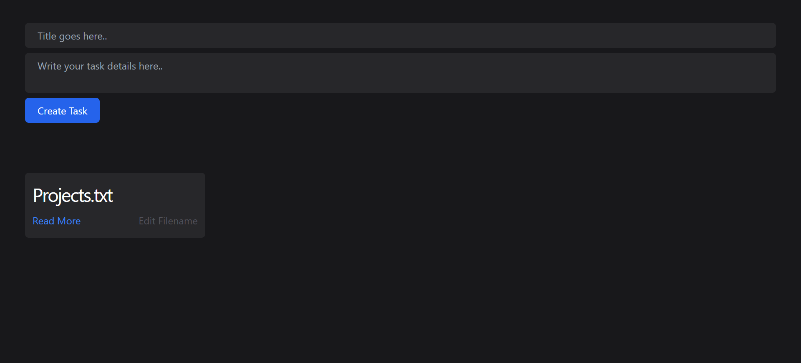
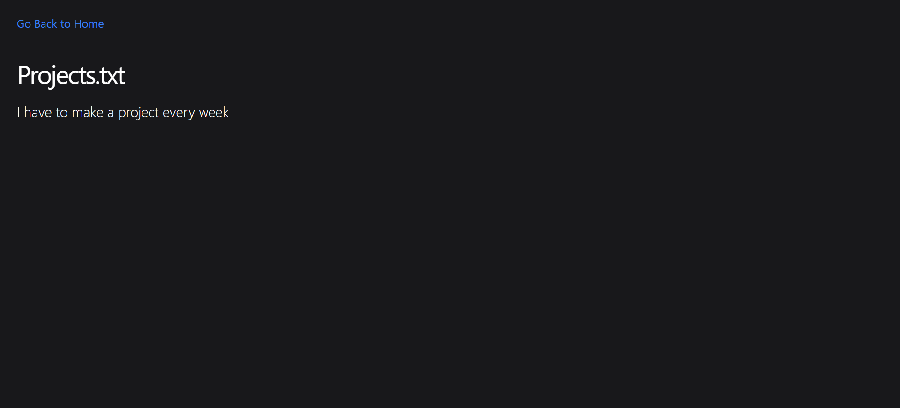
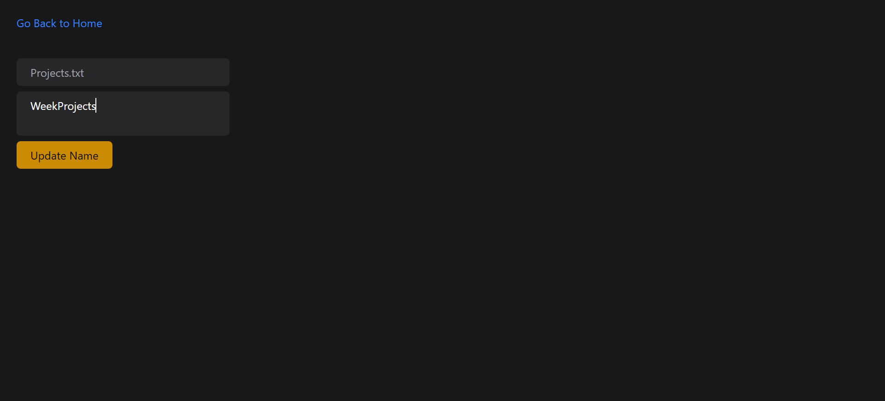

# ToDoListApp

A simple To-Do List application that allows users to manage their tasks efficiently. This application provides a user-friendly interface for adding, viewing, updating, and deleting tasks.

## Features

- Add new tasks with descriptions
- View, edit tasks
- Responsive design for both desktop and mobile devices

## Technologies Used

- **Frontend**: HTML, CSS
- **Backend**: Node.js, Express.js
- **Template Language**: EJS
- **Database**: MongoDB

## Screenshots

To provide a better understanding of the Recipe Book application, here is a screenshot:

##Main Interface

##Task Interface

##Read More Interface

##Update Interface

Feel free to customize this template according to your project's specific needs and details!

For any inquiries, please contact:

Name: Gauranshi Varshney
Email: gauranshivarshney@gmail.com
